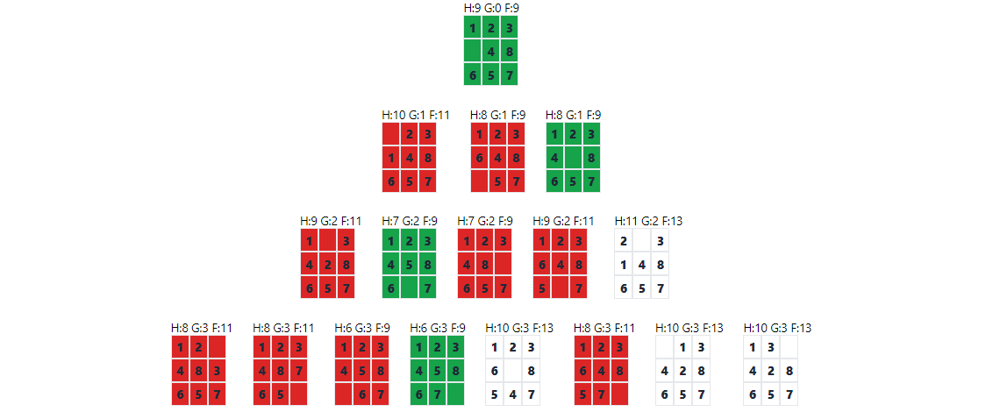

# A-Star
Example of the implementation of the A*(A-Star) algorithm in the search for the best path in the 8-Puzzle game

# About
The A* algorithm (pronounced "The Star") is a search algorithm used in artificial intelligence and many problem-solving applications, especially graph pathfinding problems. It was developed by Peter Hart, Nils Nilsson and Bertram Raphael in 1968 and is widely used in areas such as games, robotics, trajectory planning, among others.

The main objective of the A* algorithm is to find the shortest path (or the path with the least cost) between two points in a weighted graph. It does this efficiently, avoiding expanding too many unnecessary nodes. The A* algorithm combines two main techniques: breadth-first search and uniform-cost search. It maintains two important pieces of information for each node in the graph:

G(n): The current cost to reach the node from the starting node. It is the sum of the costs of the arcs along the path to that node.

H(n): A heuristic estimate of the cost of reaching the destination node from the current node. This heuristic is a function that provides an optimistic estimate of the remaining cost. It is important that the heuristic is admissible, meaning that it never overestimates the true cost.

A* combines this information using the following formula:

F(n) = G(n) + H(n)

The algorithm then explores the nodes with the lowest F(n) values ​​first, which makes the search more efficient, as it prioritizes the paths that appear to be promising.

A* continues to expand nodes until it finds the target node or until all nodes have been explored. When the destination node is found, the shortest path can be reconstructed by following the pointers back from the destination node to the start node.

The A* algorithm is widely used due to its efficiency and ability to find optimal solutions in many pathfinding problems. However, the quality of the solution depends on the heuristics used and, in some cases, may be affected by complex graph topologies or inappropriate heuristics. Therefore, choosing the appropriate heuristic is a critical aspect when applying the A* algorithm.

#Example

